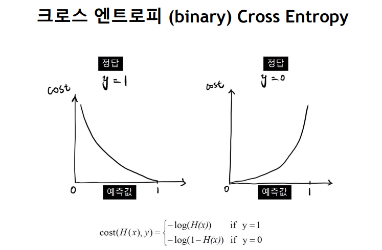

# 선형(linear), 비선형(non-lnear)

 ## 활성화함수(activation functions)
   - 딥러닝에서 사용하는 인공신경망들은 일반적으로 이전 레이어로 부터 값을 입력받아 "어떤한 함수"를 통과시킨 후 그 결과를 다음 레이어로 출력한다. 이떄 인공신경망의 은닉층(hidden layer)에 사용되는 함수를 활성화 함수라한다.

## 선형(linear)함수
  - 어떤 값을 입력 했을 때 출력이 입력의 상수 배 만큼 변하는 함수(a, b의 선형 결합)
  - f(x) = aX + b : 선형함수

## 비선형(non-linear)함수
  - 선형이 아닌 함수, 한 개의 직선으로 그릴 수 없는 함수
    1. 시그모이드 함수(sigmoid)
          
        **특징**
          - 출력값이 0과1사이다
          - 출력값의 중심이 $1/2$ 입니다.
          - 입력값이 커질수록 출력값은 1에 가까워지고, 입력값이 작아질수록 출력값은 0에 가까워진다. 

        **활용**
          - 이진 분류(binary classification) 문제에서 출력층에 사용한다. 

        **한계**
          - Vanishing Gradient 문제가 발생한다. (학습 성능이 떨어진다.)
          - 학습 속도가 느려질 수 있다  
            -> 출력값의 중심이 0이 아니기 때문에 발생한다.
          - exp 함수사용시 연산 비용이크다.  

    2. 소프트맥스 함수(Softmax function)
         
        **특징**
          - 출력값이 0과1사이다
          - 출력의 총합이 1이다. 

        **활용**
          - 다중 클래스 분류(multi-class classification) 문제에서 출력층에 사용한다. 
                    

    3. ReLu함수 (Rectified Linear Unit function)
         
        **특징**
          - 입력값이 0보다 작으면 출력값은 0이 되고, 입력값이 0보다 크면 출력값은 $x$가 됩니다.
          - 입력값이 0보다 작으면 기울기(gradient)는 0이고, 입력값이 0보다 크면 기울기(gradient)는 1입니다 

        **한계**
          - Dying ReLU 문제가 발생합니다. (학습 성능이 떨어집니다.) 
            ->Dying ReLU 문제는 ReLu 함수에서 입력값이 0보다 작을 때 기울기(gradient)가 0이 되어 해당 뉴런이 죽는 것을 말합니다.  
        
- 가중치 소실 문제(Vanishing gradient)

  - 깊은 인공 신경망을 학습하다보면 역전파 과정에서 입력층으로 갈 수록 기울기(Gradient)가 점차적으로 작아지는 현상이 발생할 수 있다. 입력층에 가까운 층들에서 가중치들이 업데이트가 제대로 되지 않으면 결국 최적의 모델을 찾을 수 없게 되는 현상을  **기울기 소실(Gradient Vanishing)**이라 한다.  

# 트레이닝 데이터와 검증 데이터 비교

- train data (학습데이터)
  - 학습해야 하는 모델의 핵심 데이터 세트   

- validation data (검증데이터)
  - 정말로 이해하는지를 확인하기위한 모델의 새 데이터

- test data (테스트 데이터)

- 과적합 (overfitting)
  - 모델이트레이닝 데이터에 대한 좋은 성능을 보이지만 검증 데이트는 그렇지 못함
 - 정확도 및 손실이 두 데이터세트 간에 유사해야 이상적임
 `` model.fit(x_train, y_train, epochs =20, verbose=1, validation_data=(x_valid, y_valid)) ``

# 크로스 엔트로피(Cross Entropy)

- **엔트로피**
  - 무질서 측도
  - 값이 클수록 데이터가 혼재, 분류가 잘 안된 상태
  - 값이 작을수록 데이커가 잘 분류된 상태

- **크로스 엔트로피(Cross entropy)**
  - 모델에서 예측한 확률 값이 실제 값과 비교했을 때 틀릴 수 있는 정보량
    - 그 값이 적을 수록 모델이 데이터를 더 잘 예측하는 모델임을 의미
  - 딥러닝에서 예측 값과 정답 값의 크로스 엔트로피 값을 줄이기 위해 가중치(w)와 편향(b)을 업데이트하며 학습(오차 역전파)
  - 분류문제에서 데이터의 라벨은 one-hot encoding을 통해 표현된다.
    > 원핫인코딩이란?  클래스의 종류가 N가지이고 특정 데이터가 n번째 클래스에 속할 때, n번째 원소만 1이고 나머지는 0으로 채운 N차원 벡터로 바꿔주는 것이다.

    
    
  - 이진분류
    
  
  - 다중분류  
  
  
  - **정리**
    

- **손실함수(Loss Function)**
  - 회귀는 주로 MSE(Mean Squared Error)
  - 분류는 Cross Entropy(binary,categorical)를 이용한다.
  - 손실함수는 머신러닝에서 모델이 나타내는 확률 분포와 데이터가 따르는 실제 확률 분포사이의 차이를 나타내는 함수이다.
  - 즉, 이 값은 0에 가까울수록 모델의 정확도가 높고, 반대로 0에서 멀어질수록 모델의 정확도가 낮다.
  - 이러한 모델 분포는 파라미터에 따라 달라진다.